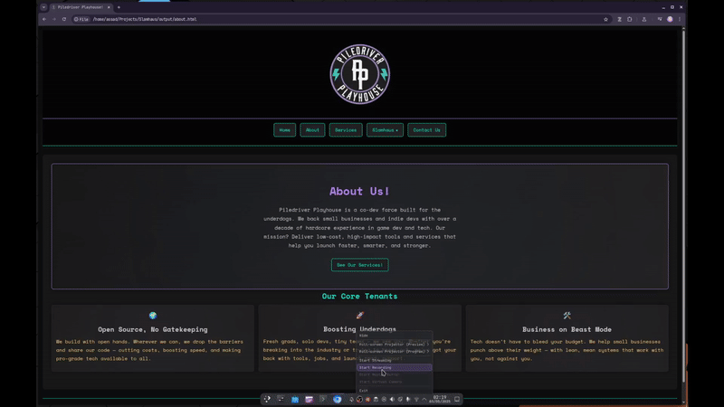

# Slamhaus

<div align="center">
  <a href="https://www.slamhaus.com">
    
  </a>
</div>

**The lightweight, Markdown-powered static site generator for developers who’d rather write than wrestle with HTML.**

👉 **[Visit Website → www.slamhaus.com](https://www.slamhaus.com)**  

🧩 **[Get VS Code Extension → Slamhaus Syntax on Open VSX](https://open-vsx.org/extension/bitboyb/slamhaus-syntax)**

📚 **[Slamhaus Syntax Reference](docs/syntax-reference.md)**

🎨 **[Slamhaus Themes & Styling](docs/themes.md)**

---

## 📦 Download Now

Get started instantly — no install scripts, no package managers. Just grab a binary:

- 🪟 [**Windows**](https://github.com/bitboyb/Slamhaus/releases/download/nightly/slamhaus-windows.zip)
- 🐧 [**Linux (Debian/Ubuntu)**](https://github.com/bitboyb/Slamhaus/releases/download/nightly/slamhaus-linux-debian.zip)
- 🎩 [**Linux (Arch)**](https://github.com/bitboyb/Slamhaus/releases/download/nightly/slamhaus-linux-arch.zip)

Or jump to [Quickstart »](#-quickstart)

---


## 🚧 Beta Notice

> **Heads up:** Slamhaus is currently in **beta**. While it’s fully functional for building and deploying sites, expect rapid iteration and breaking changes as features like WebAssembly evolve.

---

## 📘 Introduction

Slamhaus is a modern static site generator built in C++17. It converts `.md`, `.smd`, and `.slam` files into clean, fast, fully static HTML. Designed for developers who care about control and clarity, Slamhaus extends Markdown with a readable, hackable syntax for layout, buttons, forms, scripting, and more — all with zero JavaScript required.

Built like a game engine, Slamhaus features a modular C++ architecture, real-time WebAssembly scripting via Emscripten, and first-class support for SEO and internal link rewriting.

Whether you’re building documentation, a microproduct, or a portfolio with WASM-powered interactivity, Slamhaus gives you a toolchain that’s fast, terminal-friendly, and completely yours.

What makes Slamhaus different to other static website generators?

* **Game-dev-style architecture** with a clean C++ codebase
* **Zero JavaScript required** thanks to WebAssembly and Emscripten integration
* **Instant feedback** with custom tags for UI elements, scripting, and forms
* **No runtime dependencies** — just Markdown in, HTML out

Whether you’re building a portfolio, documentation site, or launching a small product, Slamhaus helps you do it with speed and style — all without leaving the comfort of your terminal.

> 💬 *Pull requests welcome! Slamhaus is open-source and open-ended—bring your ideas, features, or fixes.*



---

## 🎨 Current Features

* **Markdown In → Website Out**
  Write plain Markdown; Slamhaus handles all the HTML boilerplate.

* **Modern C++ Engine**
  Performance-focused, clean separation, familiar to game-engine devs.

* **Extended Syntax**
  Custom tags for sections, columns, buttons, forms, embeds, and metadata.

* **Optional WebAssembly via Emscripten**
  Slamhaus integrates with [Emscripten](https://emscripten.org/), letting you compile C++ into [WebAssembly](https://webassembly.org/). You can bind logic to buttons and form elements—no JavaScript required.

* **Minimal, Tweakable Themes**
  Ships with lightweight CSS; swap or extend with your own styles.

* **Internal Link Rewriting**
  Automatically converts `.md`, `.smd`, and `.slam` paths to `.html` — even inside buttons, navigation, and metadata. No broken anchors, no manual rewrites.

* **MIT-Licensed**
  Free to use, modify, and distribute — forever. No restrictions, no strings attached.

---

## 🚀 Quickstart

Get up and running with Slamhaus in minutes — no installs, no setup scripts, just binaries and Markdown.

### 🛠 1. Download a Precompiled Binary

Pick your platform:

* [Windows](https://github.com/bitboyb/Slamhaus/releases/download/nightly/slamhaus-windows.zip)
* [Linux (Debian/Ubuntu)](https://github.com/bitboyb/Slamhaus/releases/download/nightly/slamhaus-linux-debian.zip)
* [Linux (Arch)](https://github.com/bitboyb/Slamhaus/releases/download/nightly/slamhaus-linux-arch.zip)

Unzip the archive and make the binary executable if needed:

```bash
chmod +x slamhaus-linux-*
```

---

### ▶️ 2. Build the Site

From the folder containing `slamhaus`, run:

```bash
./slamhaus-linux-*
```

> On Windows, just double-click `slamhaus.exe` or run it from `cmd.exe` or PowerShell.

Your static site will be compiled to a `build/` folder.

---

### 🌐 3. Open It in a Browser Or Upload to Your FTP!

```bash
cd build
```

Open `index.html` in any modern browser — you're live!

---

<details>
<summary><strong>🧱 Build from Source</strong></summary>

Want to compile Slamhaus yourself? It’s simple and dependency-light — just a compiler and `make`.

---

### 🛠 Prerequisites

Make sure you have:

* A **C++17-compatible compiler** (`g++`, `clang++`, or MSVC)
* **`make`** installed

**On Debian/Ubuntu:**

```bash
sudo apt install build-essential
```

**On Arch:**

```bash
sudo pacman -S base-devel
```

**On Windows (via MSYS2):**

```bash
pacman -S base-devel mingw-w64-x86_64-toolchain make
```

---

### 📥 Clone & Build

Download the repo or run:

```bash
git clone https://github.com/bitboyb/Slamhaus
cd Slamhaus
make
```

This will build the `slamhaus` executable in the root of the project.

---

### 🔧 What the Makefile Does

Slamhaus includes a cross-platform `Makefile` that:

* Recursively finds and compiles all `.cpp` files in `src/`
* Automatically includes all `src/` subdirectories
* Creates a `build/` directory for object files
* Statically links dependencies on **Windows** so users don’t need DLLs

The result is a clean `slamhaus` (or `slamhaus.exe`) executable in your project root.

> **Windows Note**: The `Makefile` uses `-static -static-libgcc -static-libstdc++` flags to reduce dependency issues on Windows builds. You can run `slamhaus.exe` directly in PowerShell or CMD.

---

### 🚧 Generate Your Site

1. Download a template:

   * [Slamhaus Basic Template](https://github.com/bitboyb/Slamhaus-Basic-Template)

2. Place it in the root folder and rename it to `content/`:

```
Slamhaus/
├── slamhaus
└── content/
    ├── index.md
    ├── about.md
    └── include/
        └── nav.md
```

3. Run Slamhaus and choose how you want to build:

```bash
./slamhaus
```

> On Windows: run `slamhaus.exe` in PowerShell or CMD.

* Press `1` to generate your site from the default `./content/` directory.
* Press `2` to specify a different folder (absolute or relative).

---

### 📂 Output

Your site will be generated in the `output/` folder — ready to upload anywhere.

---

### 🔧 Local Preview

You can preview the generated site using a simple local server:

> **Requirements**: Bash & Python 3 must be installed (macOS, Linux, WSL, or Git Bash on Windows).

```bash
./scripts/serve.sh    # Start the server at http://localhost:8000
./scripts/stop.sh     # Stop the server
```

---

</details>

<details>
<summary><strong>📂 Project Layout</strong></summary>

The structure below shows how a typical Slamhaus project is organized:

```text
.
├── content/                     ← Your source files (.slam pages, partials, assets)
│   ├── assets/                 
│   │   ├── media/              ← Images, videos, audio files, and other media
│   │   └── theme/              ← CSS stylesheets (merged and inlined into the final HTML)
│   ├── include/                
│   │   ├── config.ini          ← Site-wide metadata and default SEO settings
│   │   ├── header.smd          ← Partial: content rendered into the <header> tag
│   │   ├── footer.smd          ← Partial: content rendered into the <footer> tag
│   │   └── nav.smd             ← Partial: defines the site’s navigation structure
│   └── index.slam              ← The homepage of your site (written in Slamhaus Markdown)
│
└── output/                     ← The fully generated static site (HTML, CSS, JS)
```

---

### 🔍 Notes

* Use `.slam` files for full **pages** — each will be converted to an `.html` file.
* Use `.smd` files for **partials** — reusable fragments like headers, footers, and navigation.
* Partials in `include/` (e.g. `header.smd`, `footer.smd`, `nav.smd`) are **automatically rendered** into the final page template.
* The `output/` folder is regenerated on every build. It is safe to delete between builds.
* You can link between pages using `.slam` extensions in your Markdown or Slamhaus tags; these are automatically rewritten to `.html`.


</details>

---

## 🛠 Syntax Guide

<details>
<summary>Click to expand full syntax reference</summary>

---

### 📄 Basic Markdown

```markdown
# Heading 1
## Heading 2

- Bullet list

**Bold**, *Italic*, ***BoldItalic***

[Link text](page.md)
```

---

### 📦 Sections & Columns

```markdown
:section[align:center](#about)
### About Slamhaus
:/section
```

```markdown
:column[size:3](#features) Left column content
:column[]() Middle column content
:column[]()  Right column content
:/column
```

---

### 🖼️ Media: Images, Video, Audio, SVG, iFrame

```markdown


!video[width:100% height:350px](assets/demo.mp4)
!audio[controls loop](assets/sample.mp3)
!svg[width:"64" height:"64"](assets/icon.svg)
!iframe[https://www.youtube.com/embed/dQw4w9WgXcQ]()
```

---

### 💻 Code Blocks

````markdown
```cpp
#include <iostream>
int main() { std::cout << "Hello!"; }
```
````

---

### 📊 Tables

```markdown
| Feature     | Supported |
| ----------- | --------- |
| Images      | ✅        |
| Video       | ✅        |
| Audio       | ✅        |
| SVG         | ✅        |
| iFrame      | ✅        |
| Code Blocks | ✅        |
```

---

### 🔘 Interactive Buttons

```markdown
?button[action:"mailto:hi@example.com" text:"Email Us"](#email-btn)
?button[action:"/contact" text:"Contact"](#contact-btn)
?button[action:"https://example.com" text:"Visit Site"](#visit-btn)
?button[action:"myFunction" text:"Run Script"](#custom-fn)
```

---

### 📝 Forms & Inputs

```markdown
?form[action:"https://formsubmit.co/you@example.com":method:"post"](#contact-form)

?input[type:"email":name:"email":placeholder:"Your Email":required:""](#email)
?input[type:"text":name:"name":placeholder:"Your Name":required:""](#name)
?textarea[name:"message":placeholder:"Message":rows:"6":required:""](#message)

?button[text:"Send"](#send-btn)

?/form[]()
```

---

### 🔍 Page & Site Metadata

```markdown
$page[
  title:"Home"
  description:"Slamhaus homepage"
  keywords:"markdown, static site, c++, wasm"
]()

$site[
  title:"Slamhaus"
  url:"https://slamhaus.dev"
  favicon:"/assets/icons/favicon.ico"
]()
```

---

### 🧠 WebAssembly Scripting with `@script[]()`

```markdown
@script[
  src:"/scripts/greet.js"
  bind:"#greet-btn"
  call:"Greet"
  args:"name-input"
  types:"string"
  result:"greeting-output"
]()

@script[
  src:"/scripts/add.js"
  bind:"#add-btn"
  call:"Add"
  args:"num1,num2"
  types:"int,int"
  rtype:"number"
  result:"sum-result"
]()
```

| Attribute | Description                                                      |
| --------- | ---------------------------------------------------------------- |
| `src`     | Path to the generated JavaScript glue file                       |
| `bind`    | Element ID to attach event listener to (`#btn-id`)               |
| `call`    | C++ function name to call                                        |
| `args`    | Comma-separated list of input element IDs to extract values from |
| `types`   | C++ argument types (`int`, `float`, `string`, etc.)              |
| `rtype`   | Optional. Expected return type (`number`, `string`, etc.)        |
| `result`  | ID of the element to inject the return value into                |

---

### ⚙️ Example C++ Code for WASM Integration

```cpp
#include <emscripten.h>
#include <string>
#include <cstdlib>

extern "C"
{
    EMSCRIPTEN_KEEPALIVE
    int Add(int a, int b)
    {
        return a + b;
    }

    EMSCRIPTEN_KEEPALIVE
    const char* Greet(const char* name)
    {
        static std::string msg;
        msg = "Hello, " + std::string(name) + "!";
        return msg.c_str();
    }
}
```

> 💡 **No manual compilation required** — Slamhaus automatically compiles your `.cpp` source files into WebAssembly at build time and generates the JavaScript glue code for use with `@script[]()`.

Just place your `.cpp` file inside the `scripts/` folder, and reference it by name:

```markdown
@script[
  src:"/scripts/greet.cpp"
  bind:"#greet-btn"
  call:"Greet"
  args:"name-input"
  types:"string"
  result:"greeting-output"
]()
```

Slamhaus will:

* Compile `greet.cpp` into `greet.js` + `greet.wasm`
* Expose `Greet` for use in the browser
* Inject and wire up the glue code automatically

---

</details>

---

## 📁 Templates

Need a starting point? Check out the official Slamhaus starter kit:

### 🧱 [Slamhaus Basic Template](https://github.com/bitboyb/Slamhaus-Basic-Template)

A minimal, no-fluff template to help you hit the ground running. Includes:

* `index.md` homepage
* Preconfigured `config.ini`, `nav.md`, and theme files
* Asset folders for media, CSS, and icons
* Example usage of extended syntax

To use it, run this command **inside your Slamhaus directory**:

```bash
git clone https://github.com/bitboyb/Slamhaus-Basic-Template content
```

Then just run:

```bash
./slamhaus
```

Your site will be built into the `output/` folder—ready to deploy.

📌 **Note:** By default, Slamhaus looks for a folder named `content/`. You can specify a different path when running it, or modify the default in `main.cpp` to suit your workflow.

---

## 🧭 Planned Features

**Emscripten Wrapper & DOM Operations.**
High-level C++ interface for DOM manipulation, event binding, and element queries—write frontend logic in C++ using Unreal-style syntax, compiled to WebAssembly.

**Micro Backends.**
Lightweight backend support for dynamic routes, form handling, and custom APIs—powered by embedded C++ logic or Docker-based microservices.

**Web-Based Editor.**
In-browser Markdown+Slamhaus editor with live preview, WASM support, and one-click export—ideal for fast iteration and non-technical users.

---

## 💡 Philosophy & Design Goals

**Keep it simple, stupid.**
Slamhaus is built around a minimal, readable syntax that’s easy to learn and extend. If you know a little C++ and Markdown, you can do a lot.

**Game-dev style codebase.**
Inspired by game engine architecture, Slamhaus is structured for performance, clarity, and hacking. It's designed to feel familiar to developers from the game world.

**Not trying to be everything.**
This isn’t a bloated site builder. Slamhaus is a fast, dependable tool—just enough to get the job done and get out of your way.

**Future-minded.**
With WebAssembly integration on the roadmap, Slamhaus aims to give C++ devs a way to build not just static sites—but full-featured, interactive web experiences (maybe even games).

---

## 🛠 Contribution

Slamhaus is open-source and in active beta — which means your ideas, bug reports, and improvements are **not just welcome, but needed**.

If you're interested in contributing:

* 🐞 **Found a bug?** Open an issue with a short description and steps to reproduce.
* 🧱 **Have a feature idea?** Check if it's already planned in [🧭 Planned Features](#planned-features), or pitch it in a new discussion or issue.
* 🧑‍💻 **Want to write code?** Fork the repo, make your changes in a new branch, and open a PR when ready.
* 📝 **Docs and examples help too!** Even clarifying a sentence or sharing how you used Slamhaus is valuable.

---

### ✅ Pull Requests

All code contributions must be made via **pull requests**. This ensures clear history, code review, and automated builds across platforms.

Our build system is powered by [GitHub Actions](https://docs.github.com/en/actions):

* 🧪 Every PR is compiled and tested on **Linux**, **Windows**, and **Arch** using our `Makefile`.
* 📦 Precompiled binaries for each supported OS are automatically uploaded to the [Releases](https://github.com/bitboyb/Slamhaus/releases) page under the `nightly` tag.
* 🔒 This setup helps ensure cross-platform stability and reproducibility with minimal dependencies.

Please check that your PR builds cleanly on your platform, and include a short explanation of what it adds or fixes.

---

## ⚙️ About the C++ Codebase

Slamhaus is written in modern **C++17**, designed to be lightweight, modular, and familiar to developers from game development or systems programming backgrounds.

> Slamhaus isn’t just written in C++ — it’s structured like an engine:
>
> * Input is data (`.md`, `.smd`, `.slam`)
> * Output is artifacts (`.html`, `.wasm`)
> * Systems are isolated, composable, and explicit — no global state
>
> The architecture is friendly to engineers who think in terms of compilers, render passes, or asset pipelines — not front-end frameworks.

### 🔍 Code Philosophy

* **Readable, not clever** — The code favors clarity over compression. It's meant to be hackable and approachable, especially for students and indie devs.
* **Game-engine inspired** — Namespaces and folder structure reflect common engine conventions: `core`, `cli`, `parser`, `util`, `wasm`, etc.
* **Minimal dependencies** — Slamhaus uses only the C++ standard library. No Boost. No heavy runtime frameworks. Portability is a priority.
* **Modular, not monolithic** — Each component (parser, renderer, WASM, CLI, etc.) is designed to be isolated, reusable, and replaceable.

### 🗂 Folder Structure

```
src/
├── cli/        ← CLI utilities and menus
├── core/       ← Site generation, config, templates, assets
├── parser/     ← Markdown parsing and Slamhaus tag logic
├── util/       ← Small helper modules (e.g., string utils)
├── wasm/       ← Optional C++→WASM compilation logic
```

### 🧪 Standards & Practices

* **C++17 only** — Use language features available in `-std=c++17` for compatibility.
* **Header + Impl Separation** — Each `.hpp` file contains minimal declarations and lightweight comments; implementations live in `.cpp` under the same path.
* **No global state** — Config and page state are passed explicitly via structs like `SEOData` or `ParseState`.

### 💡 Code Style

* Use **`namespace` blocks** instead of classes where appropriate (e.g. `Parser::ParseMarkdown()`).
* Keep comments **concise** but useful—especially in public headers.
* Stick to **camelCase for variables** and **PascalCase for structs/functions**.

> If you're familiar with engines like Unreal or Godot, Slamhaus should feel immediately intuitive.

---

### 🔎 Discovering Functions in Slamhaus

Slamhaus is structured for clarity and exploration — all public functions are **declared and documented** in `.hpp` header files using concise, purpose-driven comments. If you're browsing the codebase, this is your map.

#### 🧭 Project Structure

| Folder             | Description                                                                        |
| ------------------ | ---------------------------------------------------------------------------------- |
| `src/core/`        | Core build logic: site generation, config, templates, metadata                     |
| `src/parser/`      | Markdown parsing + Slamhaus syntax handlers (`:section[]()`, `?form[]()`, etc.)    |
| `src/wasm/`        | WebAssembly integration (via Emscripten) and HTML/DOM glue                         |
| `src/util/`        | General-purpose helpers for string trimming, link adjustments, etc.                |
| `src/cli/`         | CLI menus, ASCII branding, and interactive prompts                                 |

---

### 📌 Sample Function

```cpp
// src/parser/element.hpp

#pragma once

#ifndef ELEMENT_HPP
#define ELEMENT_HPP

#include <string>
#include <sstream>
#include "parser.hpp"

namespace Interaction
{
    /// Handles interactive elements like buttons, inputs, and textareas.
    /// Parses lines like `?button[]`, `?input[]`, and `?textarea[]` and emits HTML.
    ///
    /// @param line   The raw Markdown line to evaluate
    /// @param html   The output HTML stream to append to
    /// @param pState The current parser state for list/form handling
    /// @return       True if the line was successfully handled and emitted as HTML
    bool IsInteraction(const std::string& line, 
                       std::ostringstream& html, 
                       Parser::ParseState& pState);
}

#endif // ELEMENT_HPP
```
```cpp
bool IsInteraction(const std::string &line,
                  std::ostringstream &html,
                  Parser::ParseState &pState)
{
    if (IsButtonLine(line))
    {
        Text::CloseLists(html, pState);
        html << ProcessButton(line, pState) << "\n";
        return true;
    }
    if (IsInputLine(line))
    {
        Text::CloseLists(html, pState);
        html << ProcessInput(line, pState) << "\n";
        return true;
    }
    if (IsTextareaLine(line))
    {
        Text::CloseLists(html, pState);
        html << ProcessTextarea(line, pState) << "\n";
        return true;
    }
    return false;
}
```

---

## ❓ FAQ

<details>
<summary>What is Slamhaus, exactly?</summary>

Slamhaus is a fast, Markdown-powered static site generator built in C++. It lets you create clean, lightweight websites using readable, extensible syntax — no JavaScript or templating engines required.

</details>

<details>
<summary>Do I need to know C++ to use it?</summary>

Nope! You can use Slamhaus with just Markdown. The C++ integration (via WebAssembly) is optional — great for interactivity, but not required for simple sites.

</details>

<details>
<summary>What file extensions does Slamhaus support?</summary>

`.md`, `.smd`, and `.slam` are all parsed as Markdown with extended syntax. Slamhaus treats `.smd` as partials, `.md`/`.slam` as full pages, and automatically rewrites their links to `.html` in output.

</details>

<details>
<summary>How do I preview my site locally?</summary>

Run `slamhaus` to generate the site, then preview it using:

```bash
./scripts/serve.sh
```

Or use any local HTTP server to serve the `output/` folder.

</details>

<details>
<summary>Where is my site output stored?</summary>

After building, everything is placed in the `output/` folder — ready to deploy on GitHub Pages, Netlify, or your own server.

</details>

<details>
<summary>Can I use my own theme or CSS framework?</summary>

Absolutely. Slamhaus includes a minimal CSS theme by default, but you can customize or replace it entirely. Just add or override files in `content/assets/theme/`.

</details>

<details>
<summary>Does it support SEO, favicons, or custom domains?</summary>

Yes! Use `$site[]()` and `$page[]()` metadata tags to define things like page titles, meta descriptions, favicons, and more.

</details>

<details>
<summary>Is Slamhaus production-ready?</summary>

For most static site use cases, yes. It’s stable and fast, but still evolving — so contributions and feedback are welcome.

</details>

<details>
<summary>Does it support blogging or dynamic content?</summary>

Right now it’s best for static pages. Micro Backend support are on the roadmap, enabling dynamic features soon.

</details>

<details>
<summary>Can I use WebAssembly without writing JavaScript?</summary>

Yes. Slamhaus lets you write C++ functions and bind them directly to your HTML using `@script[]()` — no JavaScript needed. 

Here’s an example:

**`greet.cpp`** – A native C++ function that returns a greeting message:

```cpp
#include <emscripten.h>
#include <string>

// 'extern "C"' prevents C++ name mangling so the function name is preserved
// exactly as "Greet" when exported to JavaScript.
extern "C"
{
    // EMSCRIPTEN_KEEPALIVE tells the Emscripten compiler *not* to strip away
    // this function during optimization. This ensures the function is available
    // to JavaScript via Module.ccall or Module.cwrap.
    EMSCRIPTEN_KEEPALIVE
    const char* Greet(const char* name) 
    {
        // Use a static string to keep the memory alive after the function returns.
        // This avoids returning a pointer to a temporary or stack-allocated object.
        static std::string msg;

        // Compose the greeting message using the input name.
        msg = "Hello, " + std::string(name) + "!";

        // Return a pointer to the internal C-string of 'msg'.
        // This will be read in JavaScript as the return value.
        return msg.c_str();
    }
}
```

---

**Your Markdown (.md) file** – Interactive input + button that runs `Greet()` without writing JS:

```markdown
?input[
    type:"text"
    placeholder:"Your name"
](#name-input)

?button[
    type:"button"
    text:"Say Hello"
](#greet-btn)

<p id="greeting-output"></p>

@script[
    src:"/scripts/greet.js"
    bind:"#greet-btn"
    call:"Greet"
    args:"name-input"
    types:"string"
    result:"greeting-output"
]()
```

<details>
<summary>Why C++? Isn’t that overkill for static sites?</summary>

Maybe — but it’s fast, portable, and familiar to devs from game/engine/tooling backgrounds. Slamhaus treats your site like a build artifact: predictable and performant.

</details>

<details>
<summary>How is this different from Jekyll, Hugo, or Eleventy?</summary>

Slamhaus is built entirely in C++, uses no Node or Ruby, and supports extended Markdown syntax with layout and scripting features out of the box. It’s lean, hackable, and doesn't depend on external runtimes.

</details>

<details>
<summary>Can I build my entire site from scratch with just Markdown?</summary>

Yes. You can define layout, navigation, buttons, forms, metadata, and even scripts using Slamhaus Markdown. No HTML necessary.

</details>

<details>
<summary>Where do I report bugs or request features?</summary>

Open an [issue](https://github.com/bitboyb/Slamhaus/issues), or submit a pull request if you’re feeling brave.

</details>

<details>
<summary>How are the precompiled binaries built?</summary>

All binaries are built automatically via [GitHub Actions](https://docs.github.com/en/actions) when changes are pushed to `main`. Binaries are published to the [Releases](https://github.com/bitboyb/Slamhaus/releases) page.

* ✅ **Arch-based Linux**: Tested and stable
* ✅ **Windows** (MSYS2): Tested and functional
* ⚠️ **Debian/Ubuntu-based Linux**: Built automatically, but not fully tested yet
* 🚫 **macOS**: No binaries yet, but you can compile from source using [Clang](https://releases.llvm.org/download.html) and [GNU Make](https://ftp.nluug.nl/pub/gnu/make/)

</details>