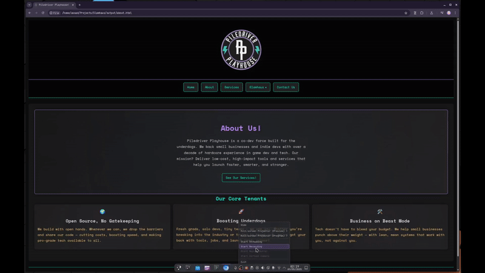

# Slamhaus

<!--  -->
<div align="center">

</div>
**The lightweight, Markdown-powered static site generator for developers who’d rather write than wrestle with HTML.**

Slamhaus is a modern C++ toolchain that converts plain `.md` files into fast, fully static websites. It supports an extended Markdown syntax for layouts, buttons, forms, embeds, and more—all while staying flexible, themeable, and dead simple to deploy. Whether you’re building a portfolio, documentation site, or a content-driven homepage, Slamhaus helps you get there faster.

> 💬 *Pull requests welcome! Slamhaus is open-source and open-ended—bring your ideas, features, or fixes.*



---

## 🎨 Current Features

* **Markdown In → Website Out**
  Write plain Markdown; Slamhaus handles all the HTML boilerplate.

* **Modern C++ Engine**
  Performance-focused, clean separation, familiar to game-engine devs.

* **Extended Syntax**
  Custom tags for sections, columns, buttons, forms and embeds.

* **Minimal, Tweakable Themes**
  Ships with lightweight CSS; swap or extend with your own.

* **MIT-Licensed**
  Do whatever you like—fork it, sell it, bend it to your will.

---

## 🚀 Quickstart

### Prerequisites

* **C++17-compatible compiler** (`g++`, `clang++`, MSVC…)
* **make**

### Clone & Build

Download [here](https://github.com/bitboyb/Slamhaus) or run this in your terminal:

```bash
git clone https://github.com/bitboyb/Slamhaus
cd slamhaus
make
```

This produces the `slamhaus` executable in your project root.

### Generate Your Site

You can download [this template](https://github.com/bitboyb/Slamhaus-Basic-Template) to get started!

Put the template inside your `slamhaus` directory and rename it to `content/`, then run:

```bash
./slamhaus
```

Everything in `content/` is transformed into a static site under `output/`—ready to deploy.

---

## 📂 Project Layout

```text
.
├── content/  
│   ├── assets/  
│   │   ├── media/        ← Images, videos, and other site media.
│   │   └── theme/        ← CSS theme files, merged & inlined into HTML.
│   ├── include/  
│   │   ├── config.ini    ← Site-wide defaults. 
│   │   ├── header.md     ← The site header. 
│   │   ├── footer.md     ← The site footer. 
│   │   └── nav.md        ← Navigation bar structure.
│   └── index.md          ← Your homepage.
└── output/               ← Your built site will be generated here.

```

---

## 🛠 Syntax Guide

<details>
<summary>Click to expand full syntax reference</summary>

### Basic Markdown

```markdown
# Heading 1
## Heading 2
- Bullet list
1. Numbered list
**Bold**, *Italic*, ***BoldItalic***
[Link text](page.md)
```

### Sections & Columns

```markdown
:section[align:center](#about)
### About Slamhaus
:/section
```

```markdown
:column[size:3](#features)
:column[left]()   Left column content
:column[middle]() Middle column content
:column[right]()  Right column content
:/column
```

### Images with Styling & Links

```markdown


```

### Video, Audio, SVG, iFrame

```markdown
!video[width:100% height:350px](assets/demo.mp4)
!audio[controls loop](assets/sample.mp3)
!svg[width:"64" height:"64"](assets/icon.svg)
!iframe[https://www.youtube.com/embed/dQw4w9WgXcQ]()
```

### Code Blocks

````markdown
```cpp
#include <iostream>
int main() { std::cout<<"Hello!"; }
```
````

### Tables

```
| Feature     | Supported |
| ----------- | --------- |
| Images      | ✅        |
| Video       | ✅        |
| Audio       | ✅        |
| SVG         | ✅        |
| iFrame      | ✅        |
| Code Blocks | ✅        |
```

### 🔘 Interactive Buttons

```markdown
?button[action:"mailto:hi@example.com" text:"Email Us"](#email-btn)
?button[action:"/contact" text:"Contact"](#contact-btn)
?button[action:"https://example.com" text:"Visit Site"](#visit-btn)
?button[action:"myCustomFunction" text:"Run Script"](#script-btn)
```

### 📝 Forms & Inputs

```markdown
?form[action:"https://formsubmit.co/you@example.com":method:"post"](#contact-form)

?input[type:"email":name:"email":placeholder:"Your Email":required:""](#email)
?input[type:"text": name:"name": placeholder:"Your Name":required:""](#name)
?textarea[name:"message":placeholder:"Message":rows:"6":required:""](#message)

?button[text:"Send"](#send-btn)

?/form
```

### 🔍 Page & Site Metadata

```markdown
$page[title:"Home"description:"Slamhaus homepage"keywords:"markdown, static site"]()
$site[title:"Slamhaus"url:"https://slamhaus.dev"favicon:"/assets/icons/favicon.ico"]()
```

</details>

---

## 📁 Templates

Need a starting point? Check out the official Slamhaus starter kit:

### 🧱 [Slamhaus Basic Template](https://github.com/bitboyb/Slamhaus-Basic-Template)

A minimal, no-fluff template to help you hit the ground running. Includes:

* `index.md` homepage
* Preconfigured `config.ini`, `nav.md`, and theme files
* Asset folders for media, CSS, and icons
* Example usage of extended syntax

To use it, run this command **inside your Slamhaus directory**:

```bash
git clone https://github.com/bitboyb/Slamhaus-Basic-Template content
```

Then just run:

```bash
./slamhaus
```

Your site will be built into the `output/` folder—ready to deploy.

📌 **Note:** By default, Slamhaus looks for a folder named `content/`. You can specify a different path when running it, or modify the default in `main.cpp` to suit your workflow.

---


## 🧭 Planned Features

* **Multiline Syntax Support**
  Improve the parser to allow extended syntax across multiple lines (currently limited to single-line commands).

* **WebAssembly Integration**
  Seamless WASM support with game-dev-style C++ wrappers—build fully dynamic websites without writing a line of JavaScript.

* **Micro Backends**
  Lightweight C++/Docker-powered backend modules for dynamic content, form handling, or custom APIs.

* **Web-Based Editor**
  A browser-based interface with built-in Slamhaus compiler—write, preview, and deploy without leaving your browser.

---

## 💡 Philosophy & Design Goals

**Keep it simple, stupid.**
Slamhaus is built around a minimal, readable syntax that’s easy to learn and extend. If you know a little C++ and Markdown, you can do a lot.

**Game-dev style codebase.**
Inspired by game engine architecture, Slamhaus is structured for performance, clarity, and hacking. It's designed to feel familiar to developers from the game world.

**Not trying to be everything.**
This isn’t a bloated site builder. Slamhaus is a fast, dependable tool—just enough to get the job done and get out of your way.

**Future-minded.**
With WebAssembly integration on the roadmap, Slamhaus aims to give C++ devs a way to build not just static sites—but full-featured, interactive web experiences (maybe even games).

---


## ❓ FAQ

<details>
<summary>Is Slamhaus production-ready?</summary>

Slamhaus is stable for static sites and lightweight personal projects. It's still evolving, so you may encounter edge cases. Contributions and bug reports are welcome!

</details>

<details>
<summary>Does it support blogging or dynamic content?</summary>

It’s primarily for static content, but dynamic functionality is on the roadmap via WebAssembly and micro backends.

</details>

<details>
<summary>Why C++? Isn’t that overkill for static sites?</summary>

Maybe! But C++ offers blazing speed, full control, and a familiar codebase for game and engine developers. Plus, it’s fun.

</details>

<details>
<summary>Can I use my own theme or CSS framework?</summary>

Absolutely. Slamhaus ships with a minimal theme, but you can override or extend styles with your own CSS.

</details>

<details>
<summary>Does it support custom domains, SEO, or metadata?</summary>

Yes. Use `$site[]` and `$page[]` tags to define titles, descriptions, keywords, favicons, and more.

</details>

<details>
<summary>Can I build my entire site from scratch with just Markdown?</summary>

Yes. Slamhaus is designed so you never need to touch HTML—unless you want to.

</details>

<details>
<summary>How is this different from Jekyll, Hugo, or Eleventy?</summary>

Slamhaus is built in C++, supports custom Markdown syntax, and is intentionally minimal. It doesn’t use JavaScript or templating engines—just Markdown and your creativity.

</details>

<details>
<summary>Where do I report bugs or request features?</summary>

Feel free to open an [issue](https://github.com/bitboyb/Slamhaus/issues), or better yet—submit a pull request!

</details>
