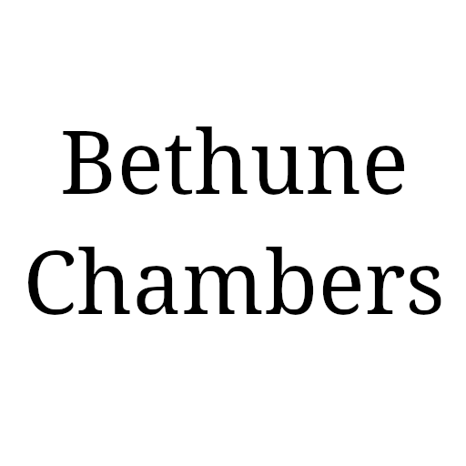

$page[description:"Indie game dev firepower, technical audio mastery, and elite coding muscle — built to amplify your team and crush deadlines." keywords:"indie game development, technical audio, game programming, unity, unreal engine, co-development, tools development, gameplay systems"]()

:section[align:center](#intro)

# Piledriver Playhouse!

:column[size:3](#intro-columns-0)
:column[left]()

### 🧠 Over a Decade of Dev Power

10+ years deep in the code mines. We’ve shipped, fixed, and rebuilt it all — from rapid-fire prototypes to beast-mode systems built to scale.

:column[middle]()

### 🎯 Small Teams, Big Impact

We roll with the indies and small crews, delivering sharp, purpose-built solutions with zero fluff and maximum punch. You bring the vision — we’ll bring the firepower.

:column[right]()

### 🔊 Technical Audio, Tuned Right

Sound is more than vibes — it’s logic, tools, and flow. From adaptive music to audio accessibility, we code with our ears on and our compilers hot.

:/column

 

:column[size:3](#intro-columns-1)
:column[left]()

### 🛠 Tech with Muscle

From hand-built tools to deep engine integrations, we make the kind of tech that stays out of your way and gets the job done. Unreal, Unity, Web — let’s roll.

:column[middle]()

### 🎮 Code for Creators

We know the grind — gameplay systems, AI logic, netcode nightmares. We drop in, get our hands dirty, and help you cross the finish line fast.

:column[right]()

### 🤝 Your Team, Amplified

No bloat, no babysitting. Just battle-ready devs who plug in, power up your pipeline, and help you hit harder. We're not consultants — we're reinforcements.

:/column

:/section

 

---

 

:section[align:center](#tech)

## Our Technology

:column[size:5](#tech-columns-0)
:column[1]()

:column[2]()

:column[3]()

:column[4]()

:column[5]()

:/column

 

:column[size:5](#tech-columns-1)
:column[1]()

:column[2]()

:column[3]()

:column[4]()

:column[5]()

:/column

:/section

 

---

 

:section[align:center](#partners)

## Our Partners & Clients

:column[size:3](#partners-columns)
:column[1]()

:column[2]()

:column[3]()

:/column

 

---

 

:/section

